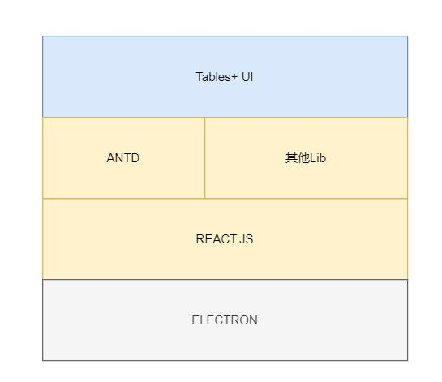
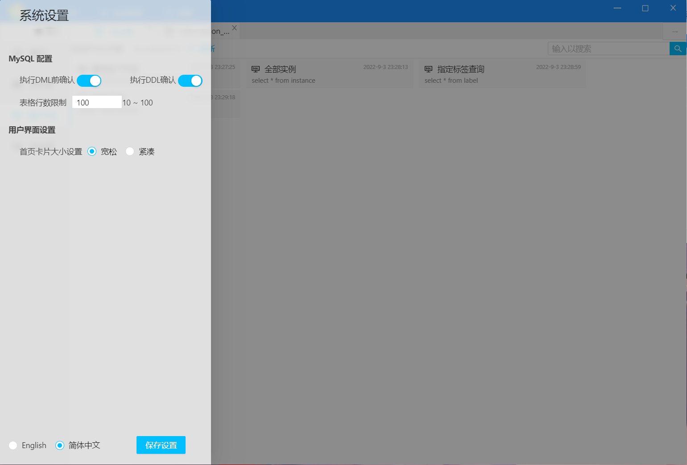
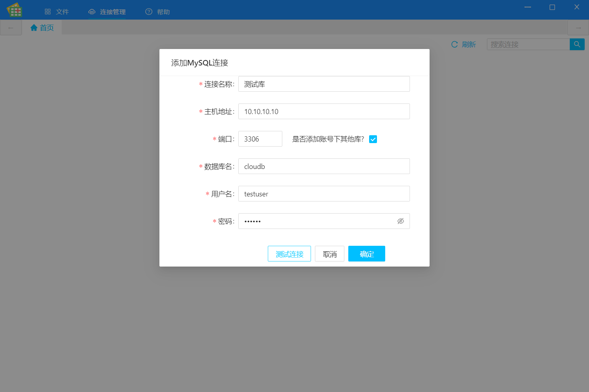
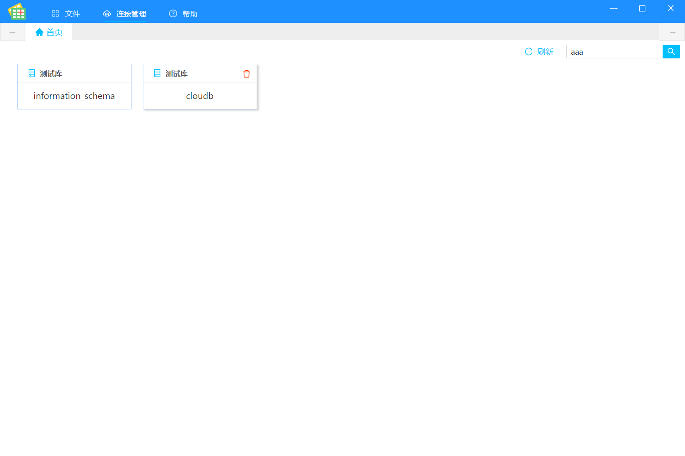
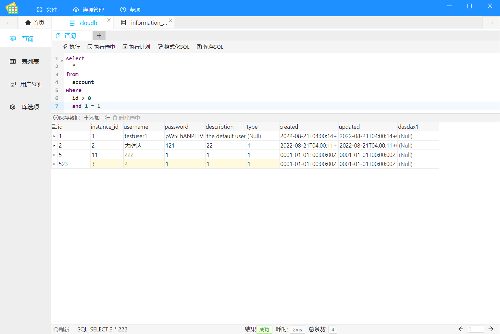
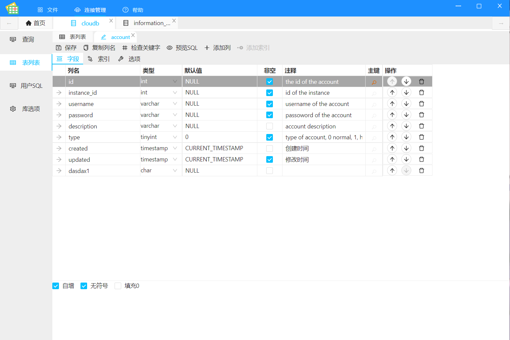
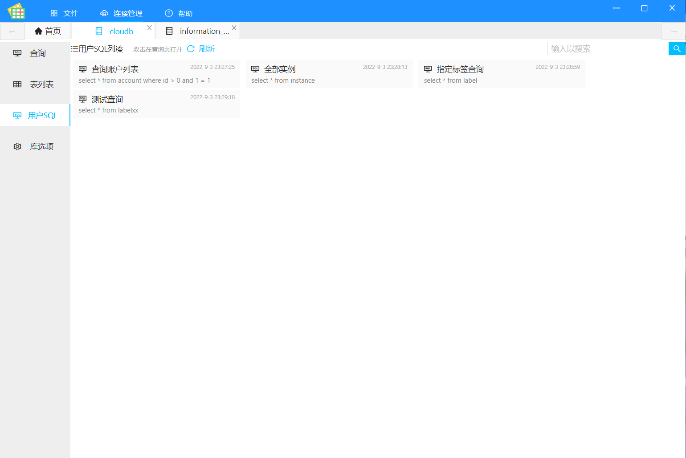

# tables+

### 介绍
tables+ 是一款相对新颖的国产MySQL可视化客户端软件，它使用最流行的 react.js + typescript + eletcron 开发， 目前第一个版本发布了，但毕竟是第一个版本， 后续还有很长的路要走。

### 软件架构
软件架构说明

### 安装教程

1. 在发行版区块找到安装包
2. 打开安装包安装即可

### 软件截图

### 使用说明

1. 打开软件后，使用连接管理添加MySQL连接（请输入正确的MySQL连接信息）
2. 添加完毕，即可在首页查看到您要操作的数据库
3. 您可以点击数据库卡片进入数据管理tab，剩下的您应该知道怎么使用了

#### 参与贡献

1.  Fork 本仓库
2.  新建 Feat_xxx 分支
3.  提交代码
4.  新建 Pull Request